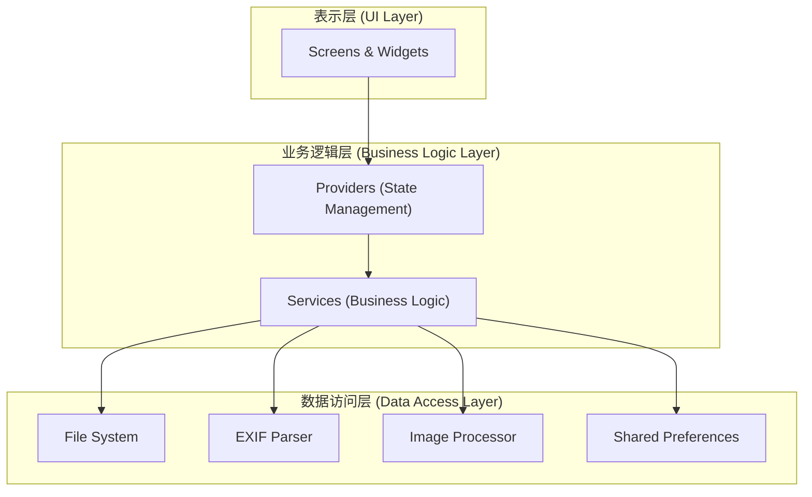
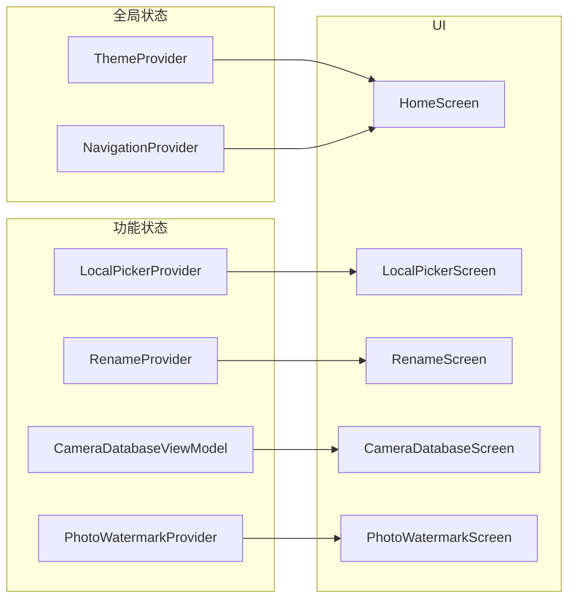
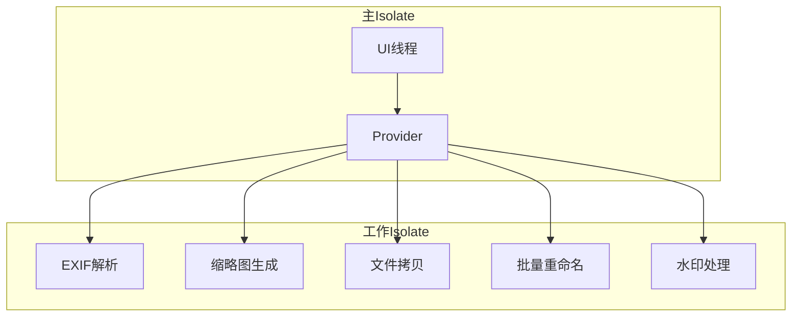
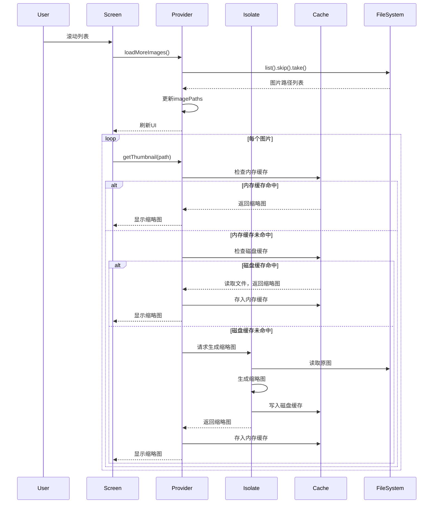
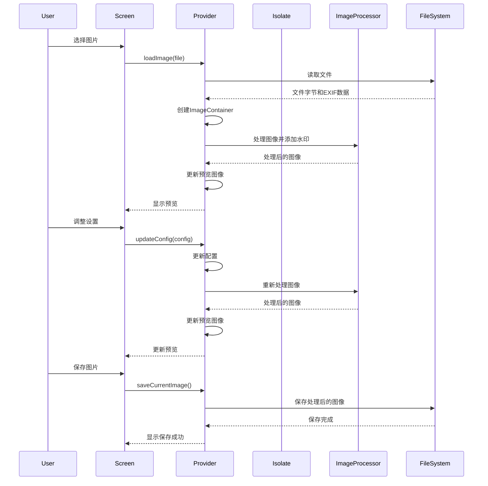

# OldSun相机工具箱

**OldSun相机工具箱** 是一款专为摄影爱好者和专业摄影师设计的跨平台桌面应用。它提供了一系列实用工具，旨在简化您的照片管理和处理工作流程。

## ✨ 功能特性

### 1. EXIF信息读取器
- **功能描述**: 轻松查看照片的详细EXIF元数据，支持多种RAW格式。
- **核心特性**:
  - **广泛的格式支持**: 支持JPG、PNG、HEIC等常见格式，以及CR2、CR3、NEF、ARW、DNG等多种RAW文件格式。
  - **详细信息展示**: 展示包括相机型号、镜头信息、快门速度、光圈、ISO、拍摄日期、GPS坐标等在内的详细EXIF信息。
  - **中文标签翻译**: 将EXIF标签翻译成中文，方便用户理解。
  - **缩略图提取**: 智能提取RAW文件中的嵌入式缩略图，提高加载速度。
  - **一键分享**: 方便地将EXIF信息复制到剪贴板，与他人分享。

### 2. 本地选片
- **功能描述**: 批量预览、选择和导出照片，支持多种常见格式。
- **核心特性**:
  - **高效的图片加载**: 采用分页加载和多级缓存机制，即使在处理大量图片时也能保持流畅。
  - **灵活的选择操作**: 支持全选、全不选、反选等多种选择操作。
  - **大图查看器**: 支持缩放、平移和键盘快捷键（F键选择，方向键导航），方便用户查看和筛选照片。
  - **RAW文件关联检测**: 自动检测与JPG文件同名的RAW文件，方便用户管理。
  - **批量导出**: 将选中的照片批量导出到指定目录。

### 3. 快速分片
- **功能描述**: 根据JPG文件自动匹配并拷贝同名RAW文件。
- **核心特性**:
  - **智能匹配**: 自动匹配文件名相同但扩展名不同的JPG和RAW文件。
  - **冲突处理**: 提供跳过、重命名、覆盖三种冲突处理策略。
  - **批量处理**: 支持批量处理，并提供进度显示。

### 4. 批量重命名
- **功能描述**: 提供多种策略批量修改文件名。
- **核心特性**:
  - **多种策略**: 支持替换、追加、自动序号和EXIF命名四种策略。
  - **实时预览**: 在执行前实时预览重命名效果。
  - **灵活排序**: 支持按名称、时间等多种方式对文件排序。
  - **文件拖放**: 支持拖放文件到应用中。
  - **文件夹选择**: 支持选择整个文件夹中的文件。
  - **撤销功能**: 支持撤销上一次重命名操作。
  - **同名合并**: 在自动序号和EXIF命名时避免重复文件名。

### 5. 相机数据
- **功能描述**: 内置相机数据库，方便查询和对比不同型号的相机规格。数据来源：[leavestylecode/CameraDatabase](https://github.com/leavestylecode/CameraDatabase)。
- **核心特性**:
  - **级联选择器**: 快速定位相机品牌和型号。
  - **结构化展示**: 以清晰的结构展示相机的关键规格参数。
  - **离线访问**: 基于项目内置的JSON数据源，无需联网。
  - **相机对比**: 支持双列并排比较不同型号的相机。

### 6. 照片边框水印
- **功能描述**: 为照片添加自定义边框和水印，支持多种布局和样式。
- **核心特性**:
  - **多种布局**: 提供纯白边框、黑红配色、背景模糊+白框等多种布局选择。
  - **自定义元素**: 支持在图片四角添加相机型号、镜头型号、拍摄参数、拍摄时间等信息。
  - **Logo支持**: 自动识别相机品牌并添加相应Logo，支持多种位置设置。
  - **颜色和样式**: 可自定义文字颜色、粗细，支持添加白边和阴影效果。
  - **批量处理**: 支持批量处理多张图片，提高工作效率。
  - **高质量输出**: 支持自定义输出质量，最高可达100%无损质量。
  - **预览功能**: 实时预览水印效果，所见即所得。

## 🚀 技术亮点

- **跨平台**: 基于Flutter框架，支持Windows、macOS和Linux。
- **高性能**: 使用Isolate进行计算密集型和IO密集型操作，如EXIF解析、缩略图生成、文件拷贝和重命名，确保UI流畅。
- **多级缓存**: 采用内存和磁盘两级缓存策略，优化缩略图加载性能，减少不必要的计算和IO操作。
- **响应式设计**: 自动适应不同屏幕尺寸和平台特性，提供一致的用户体验。
- **状态管理**: 使用Provider + ChangeNotifier进行状态管理，实现清晰的数据流和高效的UI更新。
- **错误处理**: 采用分层错误处理策略，提供用户友好的错误提示和详细的日志记录。

## 🛠️ 架构概览

### 分层架构

### 状态管理

### 并发处理

### 数据流 (本地选片)

### 数据流 (照片边框水印)

## 📦 安装与使用

访问我们的 [GitHub Releases](https://github.com/OldSuns/Camera_Toolbox/releases) 页面，下载适用于您操作系统的最新版本。

## 🤝 贡献

我们欢迎任何形式的贡献！如果您有任何建议或问题，请随时提交 [Issue](https://github.com/OldSuns/Camera_Toolbox/issues) 或 [Pull Request](https://github.com/OldSuns/Camera_Toolbox/pulls)。

## Star History

