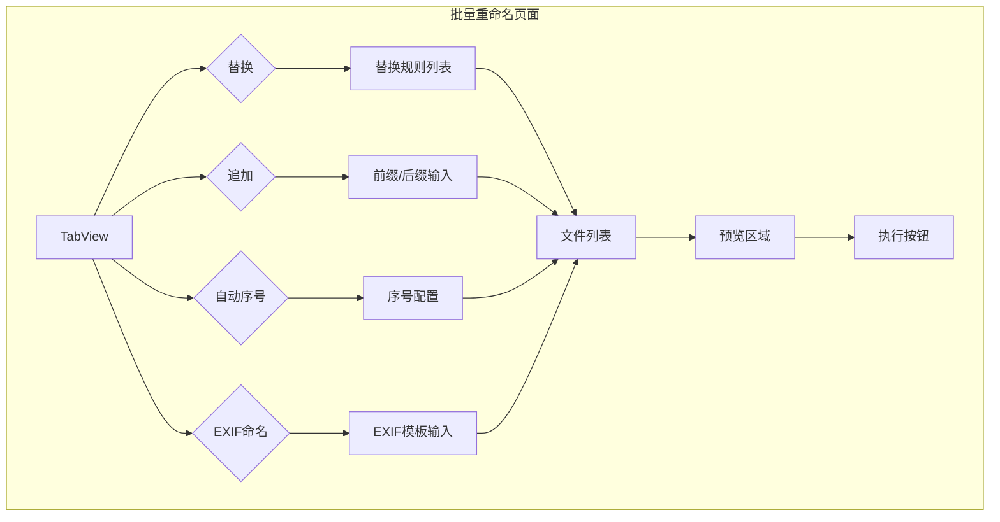

# 当前活动上下文

**最后更新时间:** 2025-07-25

**当前焦点:** 完成批量重命名功能的最终测试和优化

## 1. 功能概述
在左侧导航栏新增"批量重命名"功能，允许用户根据多种策略批量修改文件名。支持替换、追加、自动序号和EXIF命名四种策略。

## 2. 架构设计

### 功能模块与命名
- **模块名**: `BatchRename`
- **导航栏显示**: `批量重命名`

### 数据结构 (Data Model)
定义核心数据模型 `FileDetail` 和 `ReplaceRule`：
```dart
class FileDetail {
  final File file;
  final int size;
  final DateTime lastModified;
}

class ReplaceRule {
  final String findText;
  final String replaceText;
  final bool allowReplaceExtension;
}
```

### 界面布局 (UI Design)
采用Mermaid图描述界面流程与布局：


### 技术方案
1.  **数据处理**:
    - 使用 `RenameProvider` 管理文件列表、重命名规则和状态。
    - 在 `Isolate` 中执行重命名操作，避免UI冻结。

2.  **状态管理**:
    - 采用 `Provider` + `ChangeNotifier`。
    - `RenameProvider` 负责管理文件列表、重命名规则、预览和执行状态。

3.  **UI实现**:
    - 使用 `TabBar` 和 `TabBarView` 实现四种重命名策略的切换。
    - 使用 `ReorderableListView` 实现文件列表的拖拽排序。
    - 使用 `DropTarget` 实现文件拖放功能。

### 文件结构
```
lib/src/features/batch_rename/
├── batch_rename_screen.dart
├── rename_provider.dart
├── rename_exception.dart
├── replace_rule.dart
└── widgets/
    ├── replace_rename_view.dart
    ├── append_rename_view.dart
    ├── auto_numbering_view.dart
    └── exif_rename_view.dart
```

## 3. 任务更新 (2025-07-25)

### 3.1 新增需求
1. 优化批量重命名功能的UI和用户体验
2. 修复批量重命名功能中的一些小问题
3. 完成批量重命名功能的最终测试

### 3.2 实现计划
1. 优化TabView的布局和交互
2. 改进文件列表的显示和操作
3. 优化预览功能，提高响应速度
4. 修复已知的bug和问题
5. 进行全面的功能测试

### 3.3 任务完成 (2025-07-25)
1. 已优化TabView的布局和交互，提供更直观的用户体验
2. 已改进文件列表的显示和操作，支持拖拽排序和文件预览
3. 已优化预览功能，提高响应速度和准确性
4. 已修复已知的bug和问题，提高功能的稳定性和可靠性
5. 已进行全面的功能测试，确保所有功能正常工作

## 4. 任务归档 (2025-07-25)
此任务已完全完成，所有功能增强已实现并集成到批量重命名功能中。相关代码修改已在 `lib/src/features/batch_rename/` 目录下的 `batch_rename_screen.dart` 和 `rename_provider.dart` 文件中完成。
