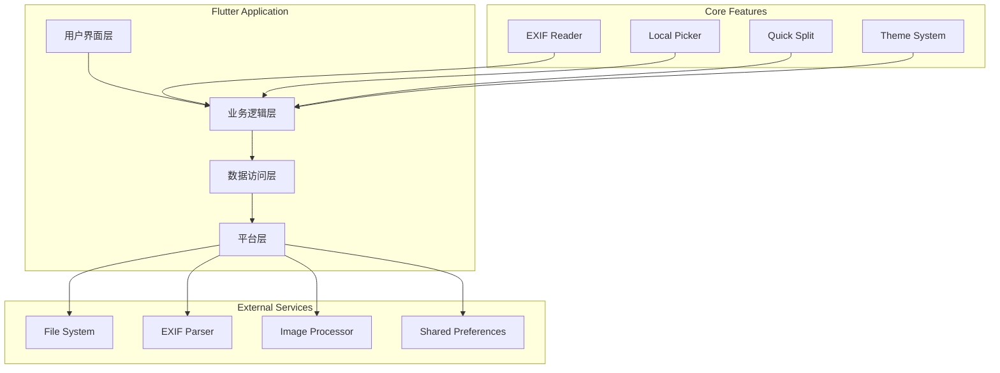
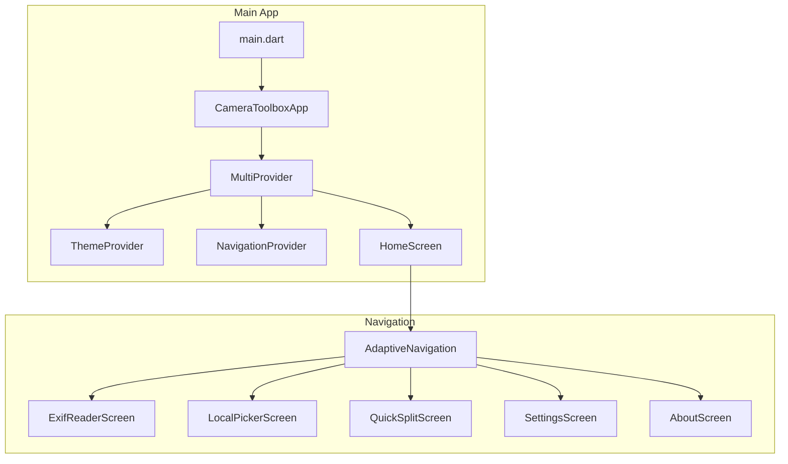
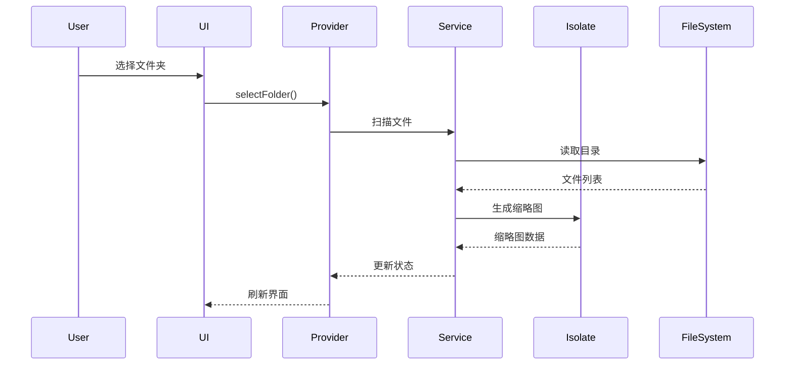
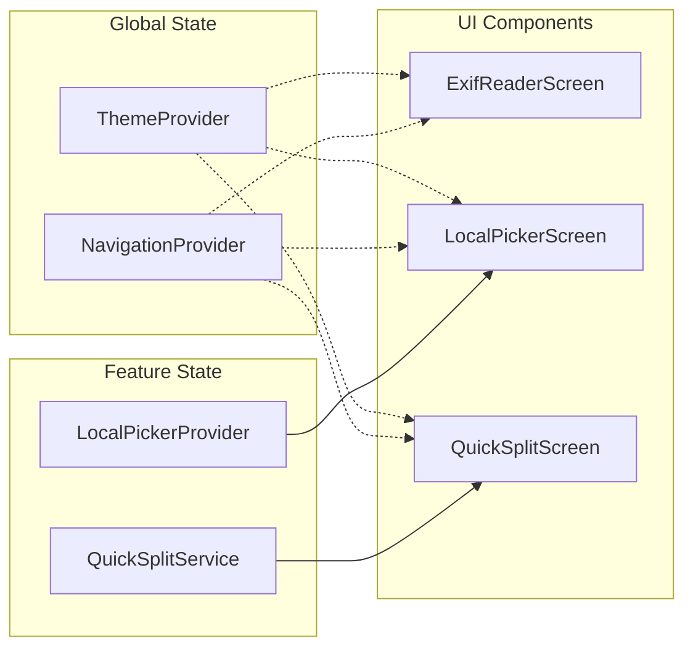
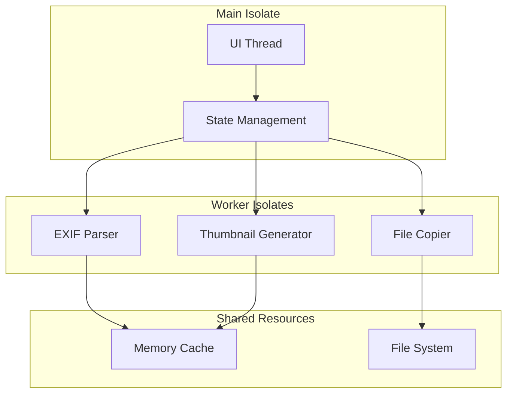
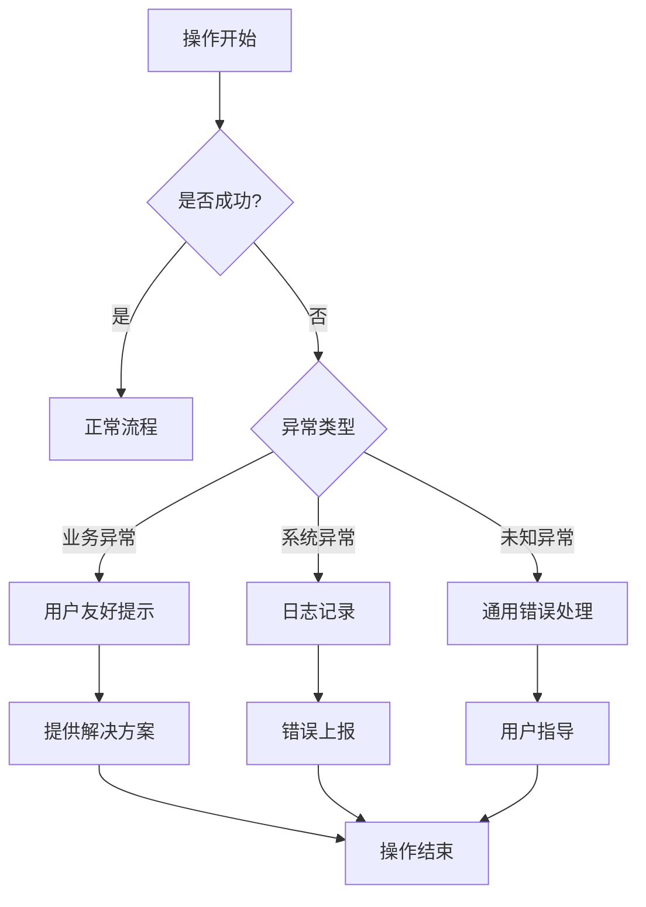
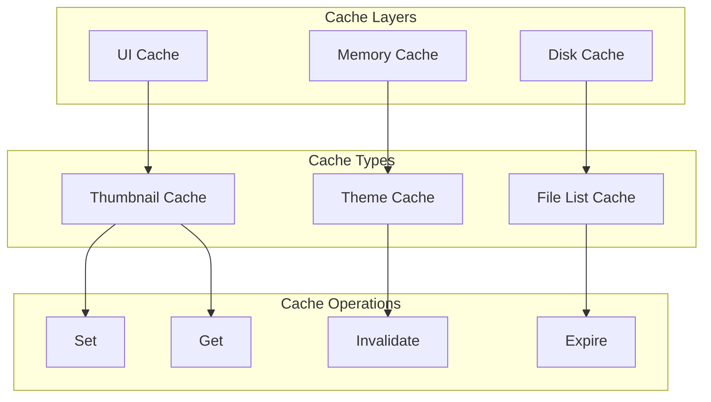
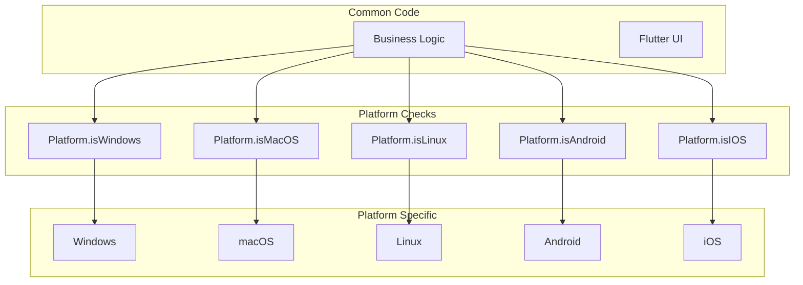
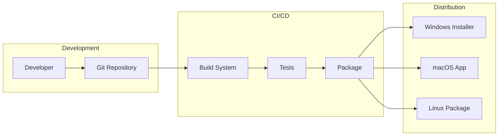

# 系统架构图

## 整体架构

```mermaid
graph TB
    subgraph "Flutter Application"
        UI[用户界面层]
        BL[业务逻辑层]
        DL[数据访问层]
        PF[平台层]
    end
    
    subgraph "Core Features"
        ER[EXIF Reader]
        LP[Local Picker]
        QS[Quick Split]
        TS[Theme System]
    end
    
    subgraph "External Services"
        FS[File System]
        EXIF[EXIF Parser]
        IMG[Image Processor]
        PREFS[Shared Preferences]
    end
    
    UI --> BL
    BL --> DL
    DL --> PF
    PF --> FS
    PF --> EXIF
    PF --> IMG
    PF --> PREFS
    
    ER --> BL
    LP --> BL
    QS --> BL
    TS --> BL
```

## 模块架构图

```mermaid
graph TD
    subgraph "Main App"
        A[main.dart] --> B[CameraToolboxApp]
        B --> C[MultiProvider]
        C --> D[ThemeProvider]
        C --> E[NavigationProvider]
        C --> F[HomeScreen]
    end
    
    subgraph "Navigation"
        F --> G[AdaptiveNavigation]
        G --> H[ExifReaderScreen]
        G --> I[LocalPickerScreen]
        G --> J[QuickSplitScreen]
        G --> K[SettingsScreen]
        G --> L[AboutScreen]
    end
```

## 数据流图

```mermaid
sequenceDiagram
    participant User
    participant UI
    participant Provider
    participant Service
    participant Isolate
    participant FileSystem
    
    User->>UI: 选择文件夹
    UI->>Provider: selectFolder()
    Provider->>Service: 扫描文件
    Service->>FileSystem: 读取目录
    FileSystem-->>Service: 文件列表
    Service->>Isolate: 生成缩略图
    Isolate-->>Service: 缩略图数据
    Service-->>Provider: 更新状态
    Provider-->>UI: 刷新界面
```

## 状态管理架构

```mermaid
graph LR
    subgraph "Global State"
        TP[ThemeProvider]
        NP[NavigationProvider]
    end
    
    subgraph "Feature State"
        LPP[LocalPickerProvider]
        QSP[QuickSplitService]
    end
    
    subgraph "UI Components"
        UI1[ExifReaderScreen]
        UI2[LocalPickerScreen]
        UI3[QuickSplitScreen]
    end
    
    TP -.-> UI1
    TP -.-> UI2
    TP -.-> UI3
    
    NP -.-> UI1
    NP -.-> UI2
    NP -.-> UI3
    
    LPP --> UI2
    QSP --> UI3
```

## 并发处理架构

```mermaid
graph TD
    subgraph "Main Isolate"
        UI[UI Thread]
        Provider[State Management]
    end
    
    subgraph "Worker Isolates"
        EXIF[EXIF Parser]
        THUMB[Thumbnail Generator]
        COPY[File Copier]
    end
    
    subgraph "Shared Resources"
        Cache[Memory Cache]
        Files[File System]
    end
    
    UI --> Provider
    Provider --> EXIF
    Provider --> THUMB
    Provider --> COPY
    
    EXIF --> Cache
    THUMB --> Cache
    COPY --> Files
```

## 错误处理流程

```mermaid
flowchart TD
    A[操作开始] --> B{是否成功?}
    B -->|是| C[正常流程]
    B -->|否| D{异常类型}
    
    D -->|业务异常| E[用户友好提示]
    D -->|系统异常| F[日志记录]
    D -->|未知异常| G[通用错误处理]
    
    E --> H[提供解决方案]
    F --> I[错误上报]
    G --> J[用户指导]
    
    H --> K[操作结束]
    I --> K
    J --> K
```

## 缓存架构

```mermaid
graph TD
    subgraph "Cache Layers"
        L1[UI Cache]
        L2[Memory Cache]
        L3[Disk Cache]
    end
    
    subgraph "Cache Types"
        T1[Thumbnail Cache]
        T2[Theme Cache]
        T3[File List Cache]
    end
    
    subgraph "Cache Operations"
        OP1[Set]
        OP2[Get]
        OP3[Invalidate]
        OP4[Expire]
    end
    
    L1 --> T1
    L2 --> T2
    L3 --> T3
    
    T1 --> OP1
    T1 --> OP2
    T2 --> OP3
    T3 --> OP4
```

## 平台适配架构

```mermaid
graph TD
    subgraph "Common Code"
        Core[Business Logic]
        UI[Flutter UI]
    end
    
    subgraph "Platform Specific"
        Win[Windows]
        Mac[macOS]
        Linux[Linux]
        Android[Android]
        iOS[iOS]
    end
    
    subgraph "Platform Checks"
        PC[Platform.isWindows]
        MC[Platform.isMacOS]
        LC[Platform.isLinux]
        AC[Platform.isAndroid]
        IC[Platform.isIOS]
    end
    
    Core --> PC
    Core --> MC
    Core --> LC
    Core --> AC
    Core --> IC
    
    PC --> Win
    MC --> Mac
    LC --> Linux
    AC --> Android
    IC --> iOS
```

## 部署架构

```mermaid
graph LR
    subgraph "Development"
        DEV[Developer]
        GIT[Git Repository]
    end
    
    subgraph "CI/CD"
        BUILD[Build System]
        TEST[Tests]
        PACKAGE[Package]
    end
    
    subgraph "Distribution"
        WIN[Windows Installer]
        MAC[macOS App]
        LINUX[Linux Package]
    end
    
    DEV --> GIT
    GIT --> BUILD
    BUILD --> TEST
    TEST --> PACKAGE
    PACKAGE --> WIN
    PACKAGE --> MAC
    PACKAGE --> LINUX
```