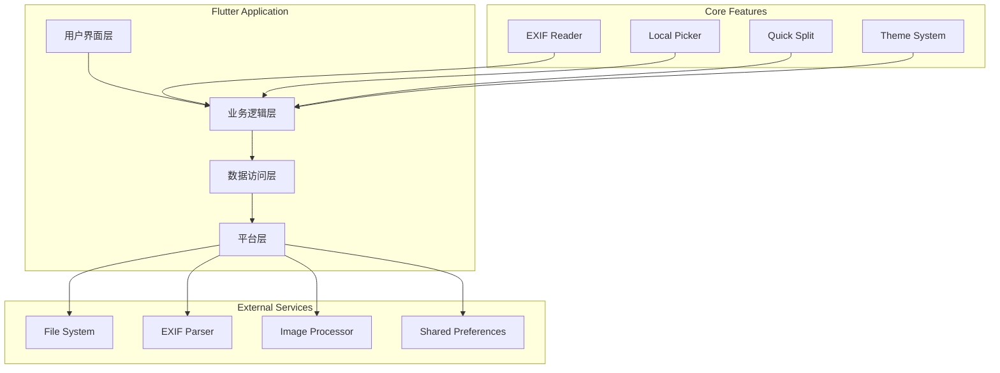
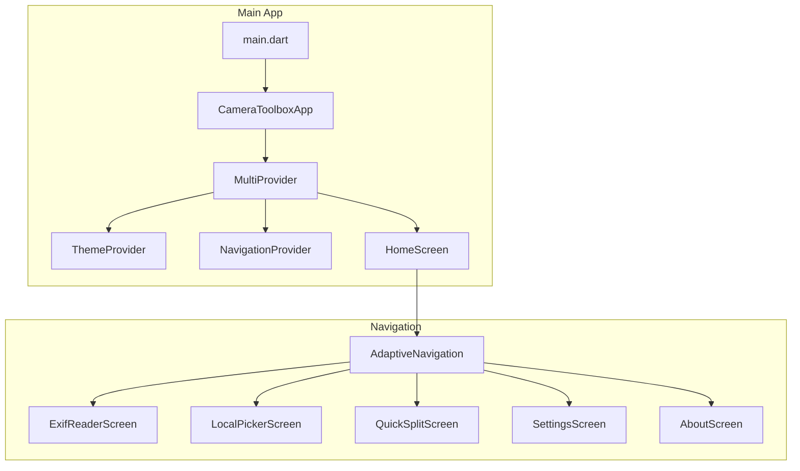
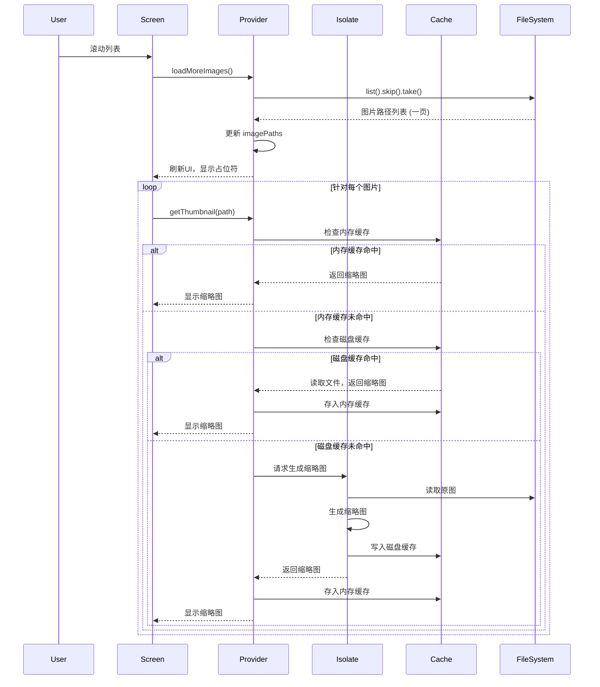
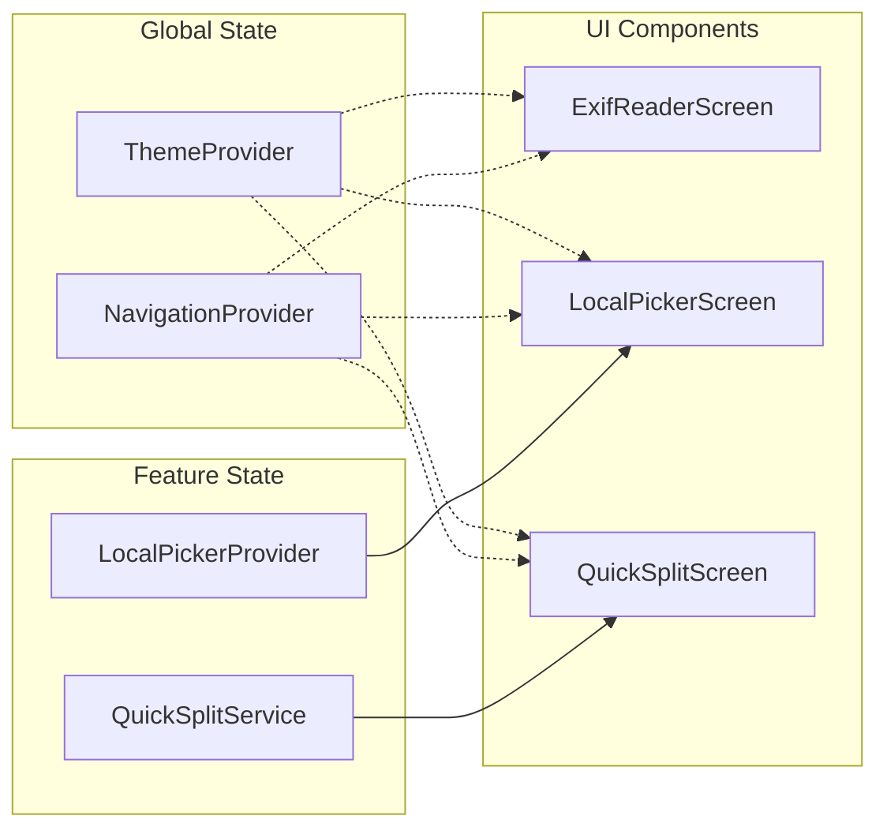
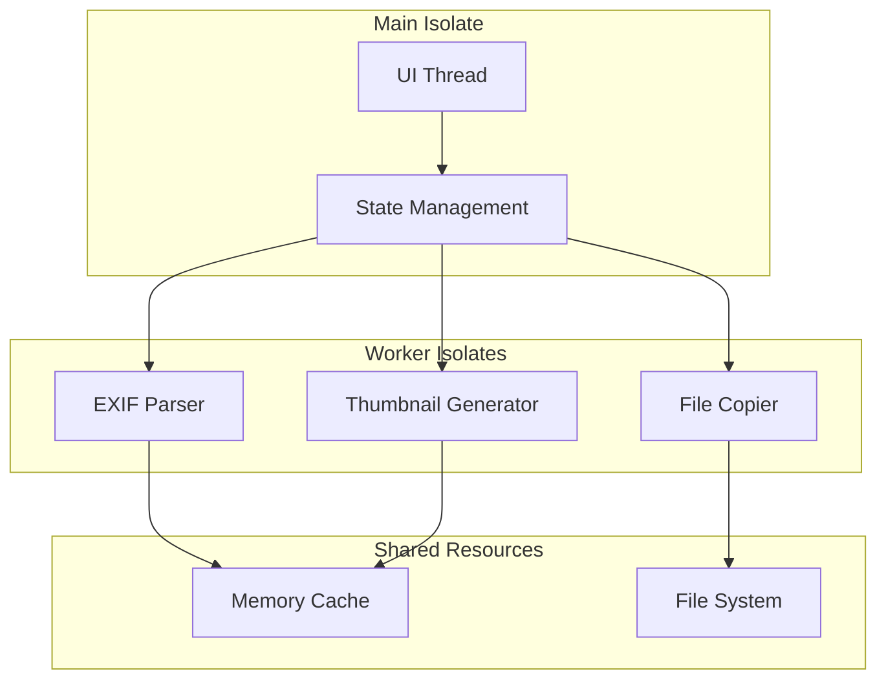
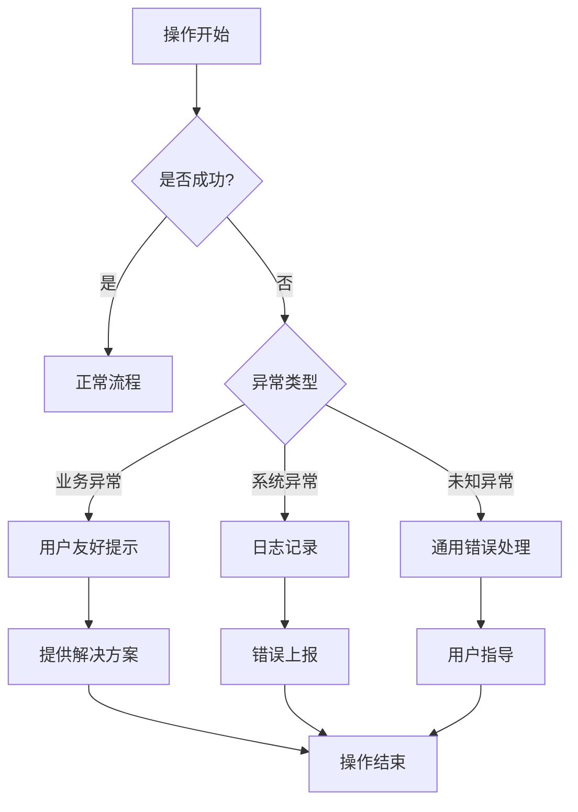
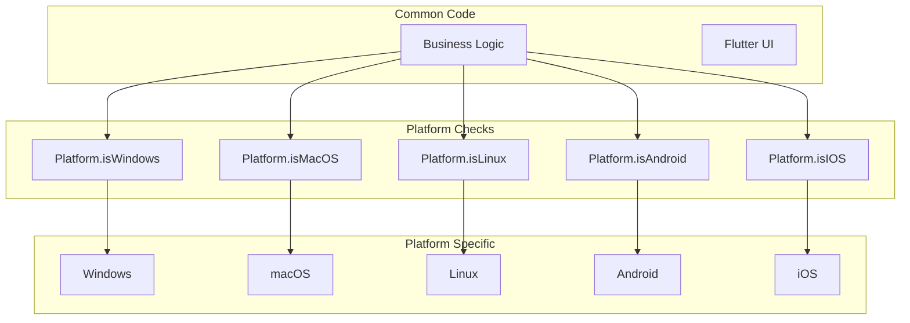
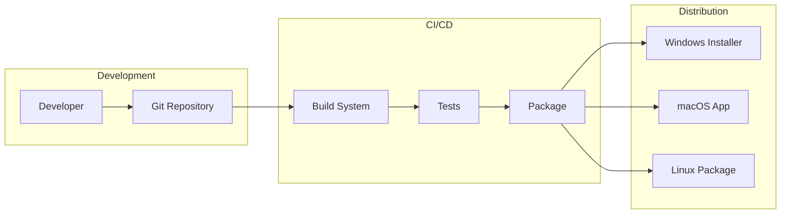

# 系统架构图

## 整体架构



## 模块架构图



## 数据流图



**说明:**

此图展示了“本地选片”功能的核心数据流，重点体现了**分页加载**和**多级缓存**机制。

1.  **分页加载**:
    *   UI (`LocalPickerScreen`) 中的 `ScrollController` 监听用户滚动行为。
    *   当滚动到列表底部时，触发 `LocalPickerProvider` 的 `loadMoreImages()` 方法。
    *   `Provider` 从文件系统 (`FileSystem`) 中仅加载下一页的图片路径 (`List<String>`)，而不是完整的图片文件，这极大地降低了单次加载的开销。

2.  **多级缓存获取缩略图**:
    *   当UI需要显示缩略图时，会调用 `Provider` 的 `getThumbnail()` 方法。
    *   **内存缓存优先**: 首先检查内存缓存 (`_thumbnailCache`)，如果命中，则直接返回数据，实现最快访问。
    *   **磁盘缓存次之**: 如果内存缓存未命中，则检查磁盘上的缓存文件。如果文件存在，则读取它，存入内存缓存以备后用，并返回数据。
    *   **后台生成**: 如果两级缓存都未命中，`Provider` 会将生成任务分派给一个独立的 `Isolate`。`Isolate` 在后台完成图片解码、缩放和编码，然后将生成的缩略图写入磁盘缓存，并返回给 `Provider`。`Provider` 再将其存入内存缓存并更新UI。

这种设计确保了流畅的用户体验，即使在处理包含数千张图片的文件夹时也能保持UI响应。

## 状态管理架构



## 并发处理架构



## 错误处理流程



## 缓存架构

```mermaid
graph TD
    subgraph "请求流程"
        A[请求缩略图] --> B{内存缓存是否存在?}
        B -->|是| C[返回内存缓存数据]
        B -->|否| D{磁盘缓存是否存在?}
        D -->|是| E[读取磁盘文件]
        E --> F[存入内存缓存]
        F --> C
        D -->|否| G[分派到Isolate生成]
        G --> H[生成缩略图]
        H --> I[写入磁盘缓存]
        I --> F
    end

    subgraph "缓存层级"
        L1[内存缓存 (Memory Cache)]
        L2[磁盘缓存 (Disk Cache)]
        L1 --> L2
    end

    subgraph "缓存实体"
        T1[缩略图 (Uint8List)]
    end

    L1 -- 包含 --> T1
    L2 -- 包含 --> T1
```

**说明:**

系统采用**多级缓存**策略来优化缩略图的加载性能和资源利用率。

*   **内存缓存 (`Map<String, Uint8List>`)**:
    *   **目的**: 提供最快速的访问，避免任何I/O操作。
    *   **生命周期**: 与 `LocalPickerProvider` 的生命周期绑定。当用户离开“本地选片”功能或应用关闭时，内存缓存被清空。
    *   **适用场景**: 用户在同一会话中反复滚动和查看图片。

*   **磁盘缓存 (`.../cache/thumbnails/`)**:
    *   **目的**: 持久化存储已生成的缩略图，避免在应用重启后重复执行昂贵的生成操作。
    *   **文件名**: 使用原图路径的MD5哈希值，确保文件名的唯一性和合法性。
    *   **生命周期**: 持久存在于应用的缓存目录中，直到用户手动清除缓存或操作系统自动清理。

这种**内存 -> 磁盘 -> 按需生成**的降级策略，平衡了访问速度、持久性和计算成本，是处理大量媒体资源的常用高效模式。

## 平台适配架构



## 部署架构

